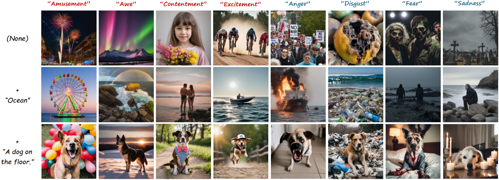
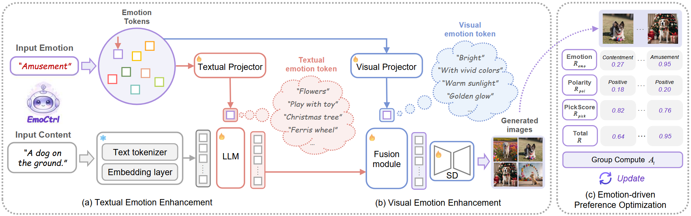
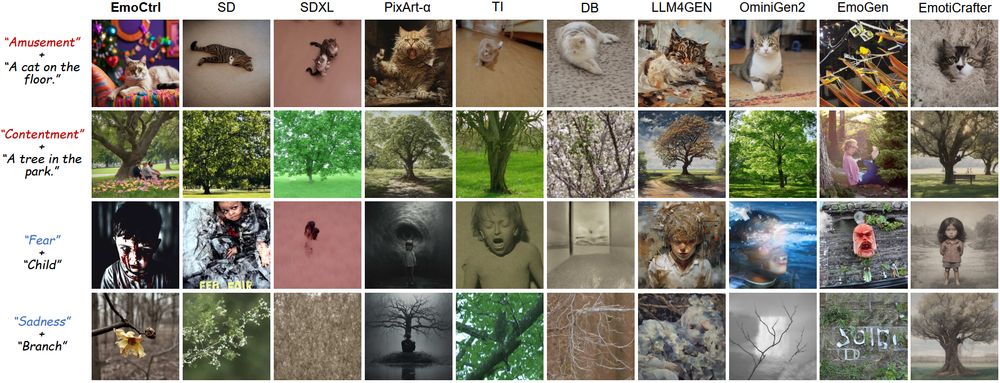
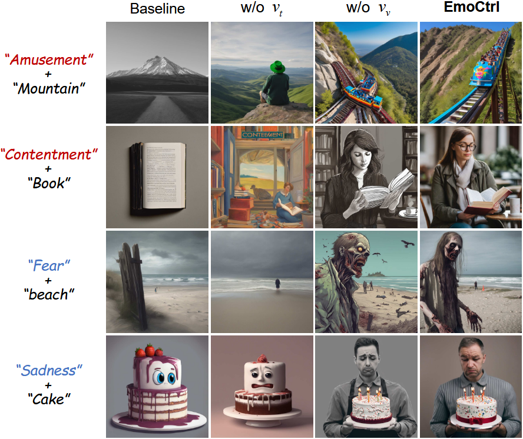
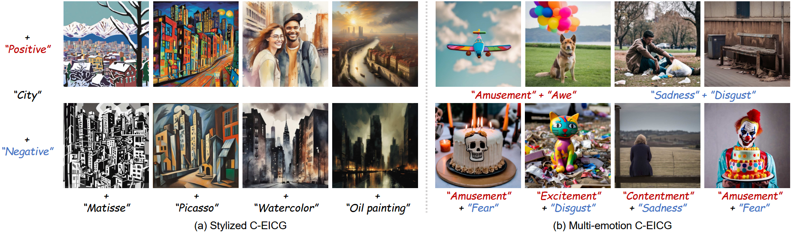

# EmoCtrl: Controllable Emotional Image Content Generation (ACM MM 2026)

This is the official implementation of paper "EmoCtrl: Controllable Emotional Image Content Generation".

> [Jingyuan Yang](https://jingyuanyy.github.io/)<sup>1</sup>, WeiBin Luo<sup>1</sup>, [Hui Huang](https://vcc.tech/~huihuang)<sup>1</sup><sup>*</sup> 
> <sup>1</sup>Shenzhen University

[](https://arxiv.org/abs/2512.22437)

<p align="left">
  
<br>
Fig 1. Controllable Emotional Image Content Generation with EmoCtrl. Given a content condition (“Ocean” ) and a target emotion (“Contentment” ), EmoCtrl generates images that maintain semantic content while vividly expressing accurate emotions.
</p>
## Preliminary

Download the pre-trained weights required for the program to run.

Qwen3-0.6B: [通义千问3-0.6B · 模型库](https://www.modelscope.cn/models/Qwen/Qwen3-0.6B/summary)

SDXL: [stable-diffusion-xl-base-1.0 · 模型库](https://www.modelscope.cn/models/stabilityai/stable-diffusion-xl-base-1.0/summary)

If you want to train your own model, you need to download both datasets.

EmoSet: [JingyuanYY/EmoSet: This is the official implementation of 2023 ICCV paper "EmoSet: A large-scale visual emotion dataset with rich attributes".](https://github.com/JingyuanYY/EmoSet?tab=readme-ov-file)

EmoEditSet: [JingyuanYY/EmoEdit: This is the official implementation of 2025 CVPR paper "EmoEdit: Evoking Emotions through Image Manipulation".](https://github.com/JingyuanYY/EmoEdit)


## Quick Start

First, you need to configure the environment.

```bash
conda create -n emoctrl python=3.11
conda activate emoctrl

# Install PyTorch with CUDA 11.8 support (must be installed before other dependencies)
pip install torch==2.6.0 torchvision==0.21.0 torchaudio==2.6.0 --index-url https://download.pytorch.org/whl/cu118

pip install -r requirement.txt
```

Then you can get started quickly and get results. Test-related parameters can be modified in the file.

```bash
python test.py
```


## EmoCtrl

<p align="left">
  
<br>
Fig 2. Overview of EmoCtrl. (a) Textual Emotion Enhancement: Emotion tokens are fused with content text in the LLM to enhance emotion at the semantic level. (b) Visual Emotion Enhancement: Emotion tokens are fused with the textual emotional condition within Stable Diffusion to produce affective images through visual cues. (c) Emotion-driven Preference Optimization: Refines the model with emotion-driven reward for better human alignment.
</p>

### Training

Stage 1: Train the textual emotion enhancement module, which includes emotion tokens and LoRA for LLM.

```bash
# Prepare training data
python data/data_process.py
# Start training
torchrun --nproc_per_node=8 train_stage1.py
```

Stage 2: Train the visual emotion enhancement module. 

```bash
# Prepare training data
python offline_data_gen.py
# Start training
accelerate launch --num_processes 8 --multi_gpu --mixed_precision "fp16" train_stage2.py
```

Stage 3: Fine-tune using EDPO.

```bash
accelerate launch train_stage3.py --config configs/grpo.py:emoset_sdxl_llm
```

You can evaluate the generated images after training.

```bash
# Emo-A, CLIP-A and EC-A
python metrics/joint.py
# LPIPS and Sem-C
python metrics/semantic.py
```


## Visualization

You can visualize the trained textual emotion tokens.

```bash
python textual_visualization.py
```


## Results

### Qualitative Results

<p align="center">
  
<br>
Fig 3. Comparison with state-of-the-art methods, showing EmoCtrl is superior in both content and emotion aspects.
</p>


### Quantitative Results

Table 1. Comparisons with four categories of state-of-the-art methods across five evaluation metrics.

|     Method      |    Emo-A ↑    |    CLIP-A↑    |    EC-A ↑     |   LPIPS ↑    |   Sem-C ↑    |
| :-------------: | :-----------: | :-----------: | :-----------: | :----------: | :----------: |
|     SD-1.5      |    16.12%     |    78.95%     |    13.65%     |    0.672     | <u>0.606</u> |
|      SDXL       |    22.37%     |    75.16%     |    16.28%     |    0.563     |    0.535     |
| PixArt-$\alpha$ |    20.72%     | <u>85.69%</u> |    17.76%     |    0.652     |    0.590     |
|       TI        |    38.82%     |    66.94%     |    22.53%     |    0.537     |    0.525     |
|       DB        |    33.75%     |    81.53%     | <u>24.86%</u> |    0.588     |    0.550     |
|     LLM4GEN     |    21.22%     |    74.51%     |    15.46%     |    0.557     |    0.506     |
|    OmniGen2     |    25.00%     |  **89.97%**   |    21.22%     |  **0.708**   |    0.595     |
|     EmoGen      | <u>45.23%</u> |    43.42%     |    14.97%     | <u>0.701</u> |    0.539     |
|  EmotiCrafter   |    24.67%     |    82.73%     |    20.23%     |    0.485     |    0.563     |
|     EmoCtrl     |  **64.64%**   |    83.06%     |  **50.99%**   |    0.699     |  **0.673**   |

Table 2. User preference study. The numbers indicate the percentage of participants who vote for the result.

| Method |  Emotion evoking↑   |  Content fidelity↑   |      Balance↑       |
| :----: | :-----------------: | :------------------: | :-----------------: |
|  SDXL  |   0.94$\pm$2.82%    |    1.35$\pm$4.56%    |   1.15$\pm$3.60%    |
|   TI   |   5.05$\pm$4.19%    |    6.46$\pm$5.75%    |   5.76$\pm$4.41%    |
| EmoGen |   5.21$\pm$4.53%    |    5.42$\pm$4.34%    |   5.31$\pm$4.20%    |
|  Ours  | **88.75$\pm$8.88%** | **86.77$\pm$11.81%** | **87.76$\pm$9.76%** |

Table 3. Ablation of EmoCtrl. Baseline is the original Stable Diffusion. v<sub>t</sub> and v<sub>v</sub> denote the textual and visual emotion tokens, respectively, while EDPO stands for Emotion-driven Preference Optimization.

|      Setting      |    Emo-A ↑    |    CLIP-A↑    |    EC-A ↑     |   LPIPS ↑    |   Sem-C ↑    |
| :---------------: | :-----------: | :-----------: | :-----------: | :----------: | :----------: |
|     baseline      |    12.50%     | <u>96.05%</u> |    12.01%     |    0.692     |    0.633     |
| w/o v<sub>t</sub> |    12.99%     |  **96.88%**   |    12.50%     |    0.679     |    0.670     |
| w/o v<sub>v</sub> |  **65.30%**   |    82.24%     | <u>50.33%</u> |    0.693     | <u>0.672</u> |
|     w/o EDPO      | <u>64.64%</u> |    80.92%     |    49.34%     |  **0.703**   |    0.658     |
|      EmoCtrl      | <u>64.64%</u> |    83.06%     |  **50.99%**   | <u>0.699</u> |  **0.673**   |


<center>
     <br>
    Fig 4. Ablation study of EmoCtrl, showing the contributions of textual emotion tokens (v<sub>t</sub>) and visual emotion tokens (v<sub>v</sub>).
</center>


<center>
     <br>
    Figure 5. Visualization of textual emotion tokens. Each row shows images generated from a specific emotion, while each column reflects diverse semantic expressions. The results show that EmoCtrl produces rich content diversity while maintaining consistent emotional tone.
</center>


<center>
     <br>
    Fig 5. EmoCtrl can be applied to creative art generation, including (a) style control and (b) multi-emotion condition.
</center>


## Citation

If you find this work useful, please kindly cite our paper:

```tex
@misc{yang2026emoctrlcontrollableemotionalimage,
      title={EmoCtrl: Controllable Emotional Image Content Generation}, 
      author={Jingyuan Yang and Weibin Luo and Hui Huang},
      year={2026},
      eprint={2512.22437},
      archivePrefix={arXiv},
      primaryClass={cs.CV},
      url={https://arxiv.org/abs/2512.22437}, 
}
```


